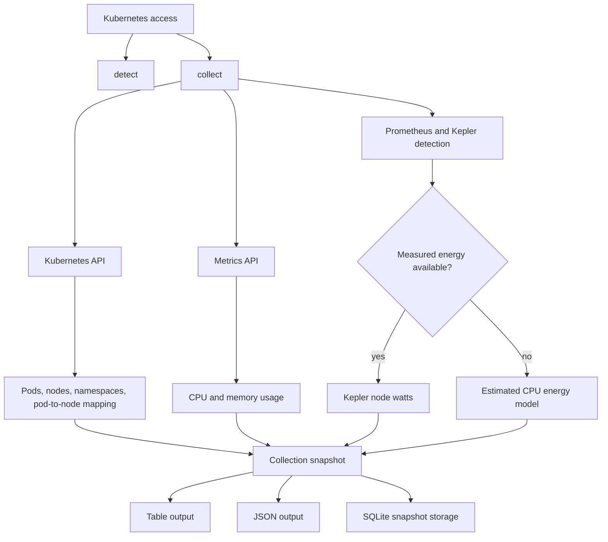

# CarbonOps

CarbonOps is an experimental Rust CLI for Kubernetes infrastructure observability, collecting workload metrics, node usage, and Prometheus/Kepler energy signals across local and cloud Kubernetes clusters.

The project is focused on learning how local and cloud Kubernetes environments differ in practice: kubeconfig access, Kubernetes API usage, Metrics API availability, Prometheus and Kepler integration, energy telemetry, and workload-to-node mapping.

Cost, energy, and carbon values are estimates unless measured telemetry is available from tools such as Kepler.

## Milestones

- Validated the same collector flow across local Kubernetes and AKS, proving CarbonOps can use Prometheus/Kepler telemetry when available and fall back to an estimated CPU-based model when needed.
- Added scoped collection and top-N workload ranking with `--namespace`, `--all-namespaces`, `--top cpu|memory|cost|carbon`, and `--limit`.

Visual gallery: [`docs/visual-gallery`](docs/visual-gallery)

## Capabilities

CarbonOps currently supports:

- detecting whether Prometheus and Kepler are available in the current cluster
- querying Kepler power metrics through Prometheus when available
- falling back to estimated node energy usage when measured telemetry is unavailable
- reading Kubernetes node, pod, namespace, and pod-to-node mapping data
- reading current CPU and memory usage from the Kubernetes Metrics API
- calculating estimated kWh, CAD cost, and carbon impact per hour
- showing the telemetry source used for each impact row
- saving structured collection snapshots into SQLite for baseline experiments

## Current Flow



## Requirements

CarbonOps uses the current Kubernetes context from kubeconfig.

For basic collection:

- access to a Kubernetes cluster
- `metrics-server` or another provider for the Kubernetes Metrics API
- RBAC permissions to read pods, nodes, services, and pod metrics

For measured energy telemetry:

- Prometheus
- Kepler
- access to query Kepler metrics through Prometheus

When Prometheus or Kepler is not available, CarbonOps still runs with the estimated CPU model.

## Usage

Run telemetry detection against the current Kubernetes context:

```bash
cargo run -- detect
```

Collect current metrics and impact estimates for one namespace:

```bash
cargo run -- collect --namespace kube-system
```

Collect across all namespaces explicitly:

```bash
cargo run -- collect --all-namespaces
```

Limit and sort workload rows:

```bash
cargo run -- collect --namespace kube-system --top cpu --limit 20
cargo run -- collect --namespace kube-system --top memory --limit 20
cargo run -- collect --namespace kube-system --top carbon --limit 20
cargo run -- collect --all-namespaces --top cost --limit 50
```

Write a structured JSON snapshot:

```bash
cargo run -- collect --namespace kube-system --output json
cargo run -- collect --namespace kube-system --top carbon --limit 20 --output json
```

Save a snapshot into SQLite:

```bash
cargo run -- collect --namespace kube-system --top carbon --limit 20 --save-sqlite carbonops.sqlite
```

When `--save-sqlite` is used, CarbonOps stores the structured snapshot and does not print table or JSON output. This is an early prototype path for collecting history before baseline and anomaly analysis.

Adjust local assumptions:

```bash
cargo run -- collect --namespace kube-system \
  --node-idle-watts 50 \
  --node-max-watts 180 \
  --electricity-cad-per-kwh 0.20 \
  --carbon-gco2e-per-kwh 400
```

Use a config file for estimate assumptions:

```bash
cargo run -- collect --namespace kube-system --config carbonops.example.toml
```

CLI assumption flags override config values when both are provided.

## AKS Testing

For AKS testing, use a separate kubeconfig file so the project does not modify the default `~/.kube/config`:

```bash
cd tofu
tofu init
tofu plan
tofu apply

az aks get-credentials \
  --resource-group rg-carbonops-aks \
  --name aks-carbonops \
  --file ./kubeconfig-aks-carbonops
```

Then run CarbonOps with that kubeconfig:

```bash
KUBECONFIG=./tofu/kubeconfig-aks-carbonops cargo run -- detect
KUBECONFIG=./tofu/kubeconfig-aks-carbonops cargo run -- collect --namespace kube-system
```
