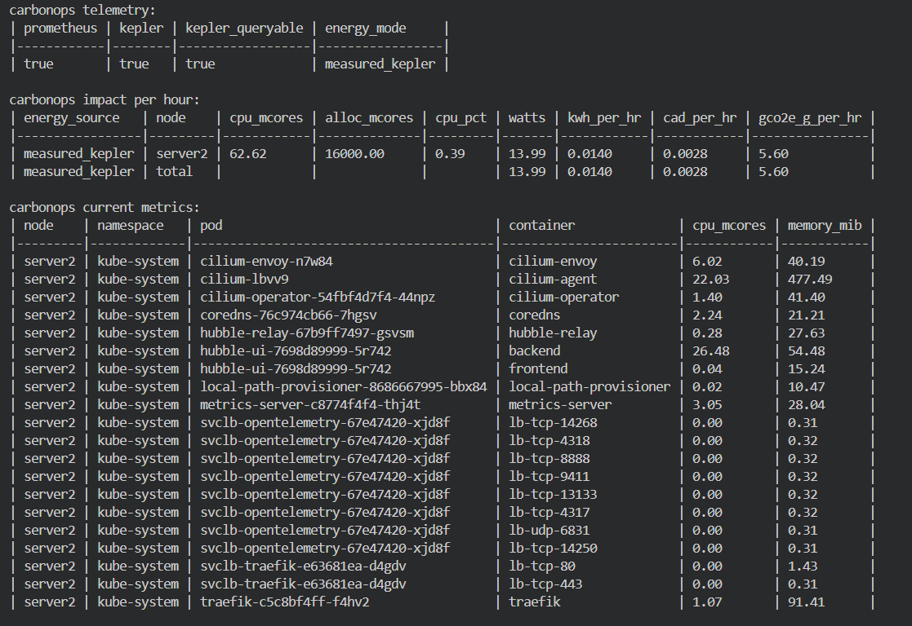
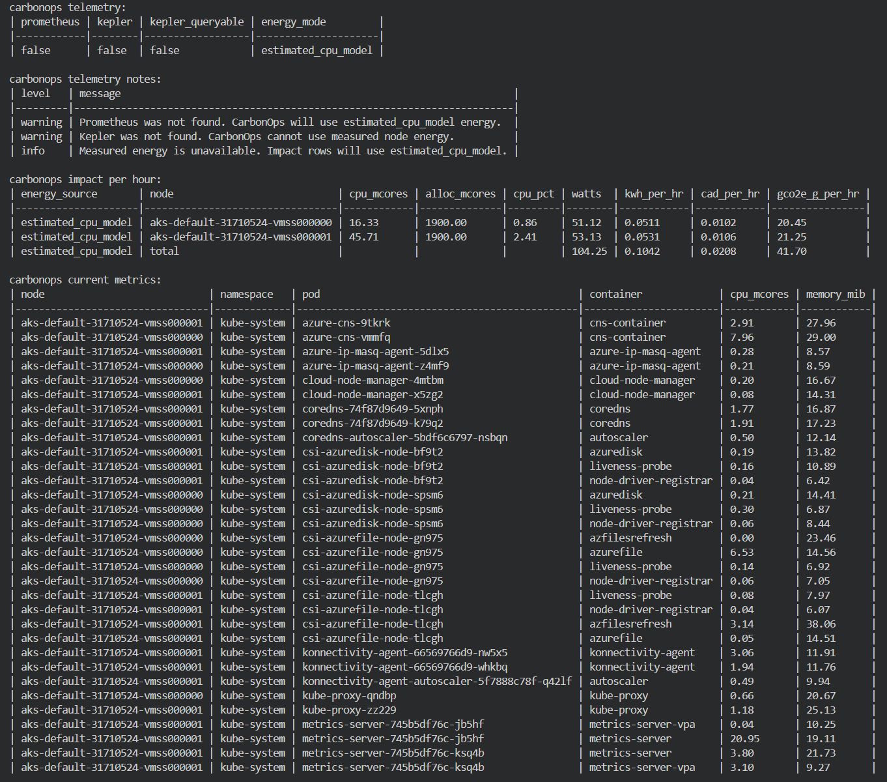

# Visual Showcase & CarbonOps Validation

This directory serves as the visual gallery for **CarbonOps**. It showcases Kubernetes infrastructure collection, telemetry detection, and Prometheus/Kepler energy signals across local and cloud Kubernetes validation environments.

## Milestone 1: Kubernetes Validation

Validate the same CarbonOps collector flow across local Kubernetes and AKS. The screenshots capture telemetry detection, impact per hour, and kube-system metrics output for both Prometheus/Kepler and estimated telemetry paths.

### Local Kubernetes: Measured Telemetry

Local Kubernetes validation with Prometheus and Kepler installed, showing the measured telemetry path.

### AKS: Estimated Fallback

AKS validation without Prometheus or Kepler installed, showing the estimated CPU-based fallback path.

